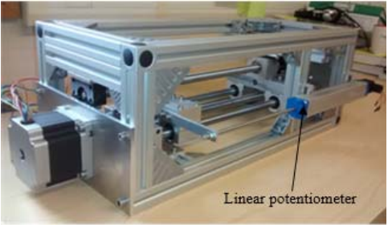
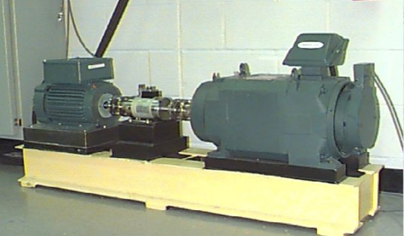
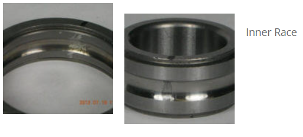
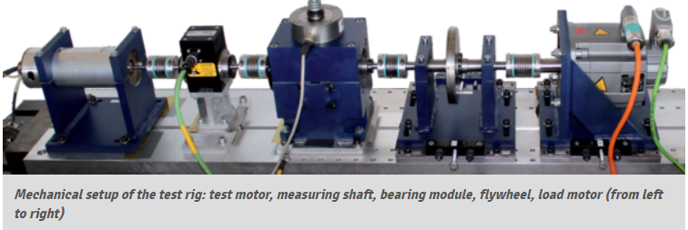
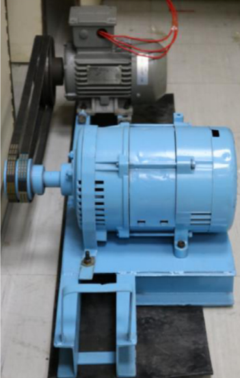
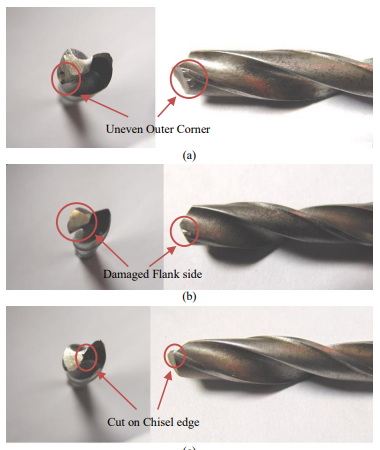

---
# doge-data

A collection of **do**main **ge**neralization **data**sets. 

We are interested in fault datasets but other kinds of datasets or contributions
are welcome. If you have any datasets suitable for domain generalization and want to contribute,
please send in a pull request. Thanks.

---

## Table of Contents

<!--

Generated with [markedpp](#markedpp). Get [nodejs](https://nodejs.org) first

1. $ npm i -g markedpp
2. $ markedpp --github -o README.md README.md

-->

<!-- !toc (minlevel=2 omit="Table of Contents") -->

* [Fault Datasets](#fault-datasets)
  * [Actuator](#actuator)
    * [CU](#cu)
  * [Bearing](#bearing)
    * [CWRU](#cwru)
    * [MFPT](#mfpt)
    * [PU](#pu)
    * [JNU](#jnu)
  * [Motor](#motor)
    * [MUET](#muet)
  * [Gear](#gear)
  * [Sensor](#sensor)
  * [Wind Turbine](#wind-turbine)
* [Relevant Links](#relevant-links)
  * [Popular Data Repositories](#popular-data-repositories)

<!-- toc! -->

---

## Fault Datasets
Datasets with multiple working conditions for condition monitoring and fault diagnosis 

### Actuator

#### CU
- [Data Link](https://cord.cranfield.ac.uk/articles/dataset/Data_set_for_Data-based_Detection_and_Diagnosis_of_Faults_in_Linear_Actuators_/5097649)
- [Paper](https://ieeexplore.ieee.org/document/8326716)
- 

  
More detail

  > **Through-life Engineering Services Institute, Cranfield University**
  > 
  >The data was acquired from a linear actuator rig operated using different loading
  > conditions and motion profiles. In addition, three different faults (lack of 
  > lubrication, spalling and backlash) were gradually seeded to the system in order
  > to study fault detection and diagnosis capabilities of different algorithms. The
  > data set includes actuator position and motor current measurements for the different
  > conditions mentioned.
  > 
  >

### Bearing
#### CWRU 
- [Data Link](https://engineering.case.edu/bearingdatacenter)
- 

  
More detail

  > **Case Western Reserve University**
  > 
  > Motor bearings were seeded with faults using electro-discharge machining
  > (EDM). Faults ranging from 0.007 inches in diameter to 0.040 inches in 
  > diameter were introduced separately at the inner raceway, rolling element 
  > (i.e. ball) and outer raceway. Faulted bearings were reinstalled into the
  > test motor and vibration data was recorded for motor loads of 0 to 3 
  > horsepower (motor speeds of 1797 to 1720 RPM).
  > 
  >
  >
  > 
  > [image source](https://www.sciencedirect.com/science/article/pii/S0019057820303335)

#### MFPT
- [Data Link](https://www.mfpt.org/fault-data-sets/#:~:text=A%20bearing%20fault%20dataset%20has,and%20three%20real%2Dworld%20faults.)
- 

  
More detail

  > **Mechanical Failures Prevention Group**
  > 
  > -3 baseline conditions: 270 lbs of load, input shaft rate of 25 Hz, sample rate of
  > 97,656 sps, for 6 seconds  
  >-3 outer race fault conditions: 270 lbs of load, input shaft rate of 25 Hz, sample 
  > rate of 97,656 sps for 6 seconds  
  >-7 outer race fault conditions: 25, 50, 100, 150, 200, 250 and 300 lbs of load,
  > input shaft rate 25 Hz, sample rate of 48,828 sps for 3 seconds (bearing 
  > resonance was found be less than 20 kHz)  
  >7 inner race fault conditions: 0, 50, 100, 150, 200, 250 and 300 lbs of load, 
  > input shaft rate of 25 Hz, sample rate of 48,828 sps for 3 seconds
  > 
  >
  >
  > 
  > [table source](https://www.sciencedirect.com/science/article/pii/S0019057820303335)

#### PU
- [Data Link](https://mb.uni-paderborn.de/kat/forschung/datacenter/bearing-datacenter)
- 

  
More detail

  >Bearings were divided into: (1) six undamaged bearings; (2) twelve artificially 
  > damaged bearings; (3) fourteen bearings with real damages caused by accelerated
  > lifetime tests. Each dataset was collected under four working conditions
  > 
  >
  > 
  > 
  > [table source](https://www.sciencedirect.com/science/article/pii/S0019057820303335)

#### JNU
- [Data Link](http://mad-net.org:8765/explore.html?t=0.5831516555847212)
- 

  
More detail

  > **School of Mechanical Engineering, Jiangnan University**
  > 
  >JNU datasets consisted of three bearing vibration datasets with different rotating
  > speeds, and the data were collected at 50 kHz. JNU datasets contained one health 
  > state and three fault modes which include inner ring fault, outer ring fault, and
  > rolling element fault.
  >
  >
  > 
  > [table source](https://www.sciencedirect.com/science/article/pii/S0019057820303335)

### Motor
#### MUET
- [Data Link](https://data.mendeley.com/datasets/fm6xzxnf36/2)  
- [Paper](https://www.ncbi.nlm.nih.gov/pmc/articles/PMC9156863/)
- 

  
More detail

  > **NCRA Condition Monitoring Systems Lab, 
  > Mehran University of Engineering and Technology***
  >
  >The dataset includes triaxial vibration data of bearing of induction motor operated 
  > under different load conditions along the axes x, y, and z. It includes triaxial 
  > vibration datasets of motor in healthy condition with and without pulley. Moreover,
  > the faulty conditions of bearings include inner race and outer race faults of (i)
  > 0.7mm, (i) 0.9mm, (i) 1.1mm, (i) 1.3mm, (i) 1.5m, and (i) 1.7mm. The bearings with
  > these fault severity levels were operated under different load conditions including 
  > 100W, 200W, and 300W. There are total 38 datasets of the bearing conditions. The 
  > data was acquired at the sampling rate of 10 kHz at the rate of 1000 samples per
  > channel.
  > 
  > 

### Drill Bit
#### IITK
- [Data Link](https://www.iitk.ac.in/idea/datasets/)
- [Paper](https://rs.ieee.org/images/files/newsletters/2015/_12_Data_Driven_Aproach_for_Drill_Bit_Monitoring_Modified_20150323.doc.pdf)
- 

  
More detail

  >Department of Electrical Engineering,
  Indian Institute of Technology Kanpur
  > 
  >The entire experimentation was performed with 3-AxisCNC EMCO Concept Mill 105. 
  > HSS twist drill bit of diameter 9 mm was used for drilling holes in the work 
  > piece made of Mild steel. For extensive experimentation, given a drill bit state
  > , for each pair of varying feed rates and cutting speed combinations, a single 
  > vibration recording of 8 seconds was taken. Feed rate was varied as 4 mm/min,
  > 8 mm/min and 12 mm/min, and Cutting speed was varied as 160rpm, 170rpm, 180rpm,
  > 190rpm and 200rpm; giving a total of 15 combination pairs.
  > 
  > 

### Gear

### Sensor

### Wind Turbine

### Relevant Links
#### Popular Data Repositories
- [Google Dataset Search](https://datasetsearch.research.google.com/)
- [Data in Brief](https://www.data-in-brief.com/)
- [Zenodo](https://zenodo.org/)
- [Data-World](https://data.world/)
- [Mendeley Data](https://data.mendeley.com/)
- [figshare](http://figshare.com/)
- [Zenodo](https://zenodo.org/)
- [UCI Machine Learning Repository](https://archive.ics.uci.edu/ml/index.php)
- [Harvard Dataverse](http://dataverse.harvard.edu/)
- [Dryad Digital Repository](http://datadryad.org/)
- [Github](https://github.com/)
- [Kaggle](https://www.kaggle.com/)